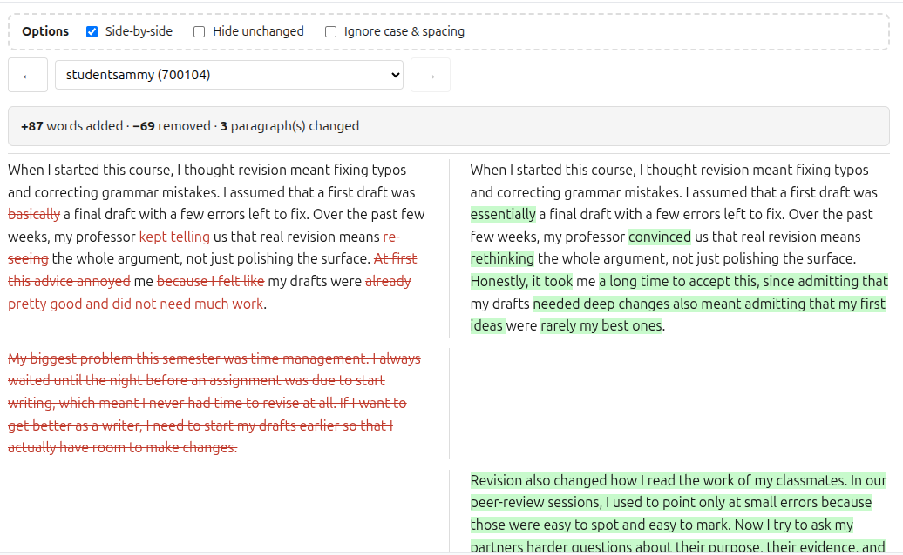

# Revision Diff

Compare a student's draft and revision in your browser, and quickly see exactly what changed. All files stay on your machine. No file is read by AI.

**▶ Use it here: [jw-docs-4644.github.io/revision-diff](https://jw-docs-4644.github.io/revision-diff/)**



## Why this exists

This tool stems from my own personal frustration in trying to compare a student's draft with their revisions. If I spend my own precious time giving a student feedback on their work, I want to see how they dealt with that feedback, and in rare cases, whether they dealt with that feedback at all.

In a perfect world, I would open the original draft and put it in a window right next to the revision, comb through both files, and evaluate the changes. [Comparing documents in Word](https://www.howtogeek.com/339166/how-to-use-microsoft-words-compare-feature/) can do something like this for one or two files at a time. But for 20 papers it becomes unmanageable. For 100, I'd argue that it's more or less impossible.

I never found quite what I was looking for, so I finally built my own.

## What it does

Select a draft and a revision (`.docx`, `.pdf`, `.txt`, or `.md`) and the tool highlights every word added, removed, or changed. It converts your documents to plain text and then uses [jsdiff](https://github.com/kpdecker/jsdiff), an open-source word-level comparison algorithm, to see what changed. You get a few options for viewing those changes:

- in-line or side-by-side
- hide paragraphs where nothing changed
- ignore case and spacing differences

### How to use it

There are basically two options for using the tool: 

- **A single pair of files.** Drop in one draft and one revision to compare them directly.
- **A whole class from Canvas.** Download the submissions for each assignment ("Download All Submissions") and drop in the two ZIP files. The tool follows the Canvas naming conventions to line up the work for each individual student: it finds the draft written by Student A and matches it up with the revision written by the same student. From there you can click forward and backward through your students' submissions as you grade.

## All files stay on your computer

No files leave your machine. Even though the tool runs in your web browser, it doesn't actually upload any files, data, or any other information to a web server or anywhere else. It also doesn't make any calls or send any data to any large language model, so none of your students' writing is being used for training or for any other purpose by any company. There is no tracking and no analytics.

If you are nervous about this (which is totally understandable), that's exactly why the source is public. Feel free to read it, tinker with it, run it through your favorite LLM and ask what it does. You can also turn off your Wi-Fi and Ethernet and use the tool entirely offline.

## A tip for Canvas users

If an assignment is meant to be a single document, configure the Canvas assignment to restrict uploads to a single file (and limit file types) under its submission settings. This enforces it at submission time rather than relying on students to comply. When a student does submit multiple files, the tool compares the most recent one (the highest Canvas submission id) and flags the others as "not compared," so nothing is silently wrong. But single-file submissions avoid the ambiguity entirely. (Assignments that legitimately ask for multiple documents, like a proposal *plus* a reflective essay, are the exception.)

## What it can't do (yet)

The tool shows you what changed between the draft and the revision. It does not show instructor or peer review comments, nor does it show rubric-based feedback for the draft. I'm working on a version that would make this possible for people who have API access to Canvas.

## Run it locally

It's a small static site built with [Vite](https://vite.dev/). To run or build it yourself:

```bash
npm install
npm run dev      # start a local dev server
npm run build    # produce a static build in dist/
```

### How it works

- Plain [Vite](https://vite.dev/) and vanilla JavaScript — no framework.
- Text is extracted from documents with [mammoth](https://github.com/mwilliamson/mammoth.js) (`.docx`) and [pdf.js](https://github.com/mozilla/pdf.js) (`.pdf`).
- Differences are computed with [jsdiff](https://github.com/kpdecker/jsdiff).
- Canvas ZIPs are read in-browser with [JSZip](https://stuk.github.io/jszip/).
- The site deploys to GitHub Pages automatically via the workflow in `.github/workflows/`.

Everything runs client-side, which you can confirm from the source: there are no network calls beyond loading the page itself.

## Feedback

If you find this useful, or if you have suggestions, I'd love to hear them — especially if you'd be interested in being able to do bulk diff checking on submissions downloaded from a different LMS. You can [report an issue or send feedback](https://sheetbend.app/contact).

## Also: organize your own teaching materials

If you find this tool helpful, you might want to try out [Sheetbend](https://sheetbend.app), which tackles another teaching problem: organizing ideas and materials. Sheetbend lets you organize your teaching materials into topics, which you can easily reorganize into new arrangements and output formats.

## License

[GNU AGPL-3.0](LICENSE) © 2026 Josh Welsh

If you host a modified version of this tool, the AGPL requires you to make your modified source available to its users. "Sheetbend" is my own name/brand and is not licensed for reuse under the AGPL.
